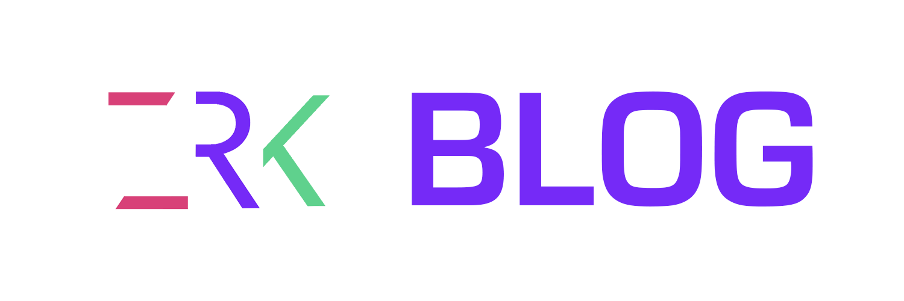

## Presentation du projet
- Blog en php orienté objet.
- Utilisation du modele MVC.
- Page d'accueil.
- Articles.
- Espace d'administration.
- Formulaire de contact.

## Pour commencer

Cloner le projet sur votre machine.

### Pré-requis

Ce qu'il est requis pour commencer avec votre projet : 

- Serveur local (Mamp, Lamp, wamp...).
- Editeur de texte (Sublime, Vs code, Atom...).

### Installation

Les étapes pour installer votre programme :

- Démarrer votre serveur local.
- Upload du fichier sql qui est à la racine du projet sur votre interface de géstion de base de donnée fournie avec votre serveur local (phpmyadmin...).
- Changement des informations de connexion à la base de donnée : /Core/Db/Db.php -> ligne 15. 

### Obtenir un compte admin

- Se connecter au SGBD corréspondant à votre serveur local.
- Ouvrir la database "blog".
- Aller au niveau de la table b_user.
- Modifier les champs u_email et u_password.
- Bien hasher le mot de passe avant d'enregistrer ici : http://www.passwordtool.hu/php5-password-hash-generator .

### Paramétrage du formulaire de contact

Changer les differents information /Controller/MainController

- ligne 23 : Votre email
- ligne 24 : Le sujet
- ligne 25 : Le message
- ligne 26 : Le header

### Démarrage

- Lancer votre serveur local.
- Pointer le serveur local sur le dossier public
- Espace d'administration : -Email : Exemple@test.com ; -Mot de passe : 1234
- Enjoy 
